# eMudi — Grocery Delivery Platform
**Architecture Document · Version 1.2**  
**Status:** Published  
**Classification:** Internal — Staff Architecture  
**Last Updated:** 2026  
**Changes from v1.1:** Payment Service promoted from external placeholder to owned component; bKash, Nagad, Card, Bank Transfer provider adapters provisioned; pre-pay model adopted; Order lifecycle extended with payment states; `orders.payment-requested` and payment response topics added; HMAC webhook validation; Payment DB added to inventory; observability expanded with payment metrics; ADR-11, ADR-12, ADR-13 added.

---

## Table of Contents

1. [Overview](#1-overview)
2. [Functional Requirements](#2-functional-requirements)
3. [Non-Functional Requirements](#3-non-functional-requirements)
4. [System Architecture](#4-system-architecture)
5. [Database Inventory](#5-database-inventory)
6. [Zone & Delivery Model](#6-zone--delivery-model)
7. [Component Design](#7-component-design)
   - 7.1 [Customer App](#71-customer-app)
   - 7.2 [Customer API Service](#72-customer-api-service)
   - 7.3 [Auth Service](#73-auth-service)
   - 7.4 [Kafka — Message Broker](#74-kafka--message-broker)
   - 7.5 [Order Receiver](#75-order-receiver)
   - 7.6 [Order Service](#76-order-service)
   - 7.7 [Location Service](#77-location-service)
   - 7.8 [Order Tracking Service](#78-order-tracking-service)
   - 7.9 [Delivery App](#79-delivery-app)
   - 7.10 [Redis Cache](#710-redis-cache)
   - 7.11 [Payment Service](#711-payment-service)
8. [API Reference](#8-api-reference)
9. [Kafka Design](#9-kafka-design)
10. [Redis Caching Strategy](#10-redis-caching-strategy)
11. [Data Design](#11-data-design)
12. [Security](#12-security)
13. [Offline Strategy](#13-offline-strategy)
14. [Scaling Strategy](#14-scaling-strategy)
15. [Observability](#15-observability)
16. [Deployment Architecture](#16-deployment-architecture)
17. [Extensibility](#17-extensibility)
18. [Architecture Decision Records](#18-architecture-decision-records)

---

## 1. Overview

**eMudi** is a grocery delivery platform operating in Dhaka, Bangladesh. Customers place grocery orders via a mobile or web application and pay before the order is dispatched. Delivery persons — assigned to specific geographic zones — collect items from the nearest grocery store and deliver to the customer's address.

**Architectural Principles:**
- **Database per service** — each service owns its data exclusively; no shared databases
- **Event-driven** — asynchronous Kafka messaging between services; REST for user-facing interactions only
- **Pre-pay model** — payment is confirmed before an order becomes visible to delivery persons
- **Async payment** — all payment providers complete via webhook; no synchronous payment assumption
- **Scale-aware** — designed to grow from 500 to 10,000 active delivery persons without re-engineering
- **Offline-resilient** — core delivery workflows function without connectivity
- **Extensible** — additional delivery categories and payment providers can be added without structural change

### System Context

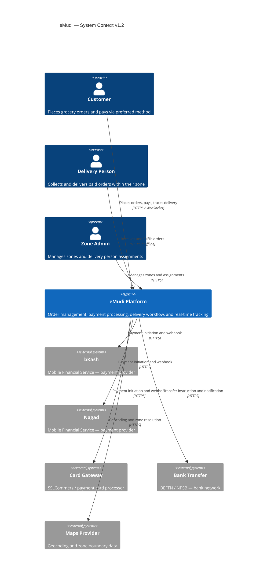

---

## 2. Functional Requirements

### Customer

| ID | Requirement |
|---|---|
| FR-01 | Customers can register, log in, and manage their account |
| FR-02 | Customers can create, edit, and delete grocery orders |
| FR-03 | Customers can submit an order and select a payment method (bKash, Nagad, Card, Bank Transfer) |
| FR-04 | Customers are guided through provider-specific payment flow (OTP, redirect, reference number) |
| FR-05 | Customers can retry a failed payment without re-creating the order |
| FR-06 | Customers receive real-time order tracking once payment is confirmed and order is dispatched |
| FR-07 | Customers are notified on every significant order and payment status transition |

### Delivery Operations

| ID | Requirement |
|---|---|
| FR-08 | Delivery persons can log in and declare themselves active in a zone |
| FR-09 | Delivery persons only see orders where payment has been confirmed |
| FR-10 | Delivery persons can mark each item as **Collected** or **Unavailable** |
| FR-11 | Delivery persons confirm dispatch and final delivery |
| FR-12 | The Delivery App must support **offline mode** for core collection workflow |
| FR-13 | Offline changes sync automatically on reconnection |

### Payment

| ID | Requirement |
|---|---|
| FR-14 | The system supports bKash, Nagad, Card, and Bank Transfer as payment methods |
| FR-15 | Each provider's payment flow is encapsulated — adding a new provider requires no structural change |
| FR-16 | All provider webhook callbacks are authenticated via HMAC signature validation |
| FR-17 | Payment attempts are idempotent — duplicate webhooks do not cause duplicate state changes |
| FR-18 | Timed-out payments are escalated to operations for manual resolution |
| FR-19 | Failed payments allow customer retry without order re-creation |

### Location & Administration

| ID | Requirement |
|---|---|
| FR-20 | Active delivery persons transmit GPS heartbeats every 15 seconds |
| FR-21 | Orders are automatically zone-assigned from the customer's delivery address |
| FR-22 | Zone administrators can manage zone boundaries and delivery person assignments |
| FR-23 | Location history is retained for audit and delivery analytics |

---

## 3. Non-Functional Requirements

| Dimension | Launch (500 Persons) | Scale (10,000 Persons) |
|---|---|---|
| Active Delivery Persons | 500 | 10,000 |
| Daily Order Volume | 10,000/day | 200,000/day |
| Average Order Payload | 500 KB | 500 KB |
| Annual Data Volume (Orders) | ~2 TB | ~40 TB |
| Location Write Rate | ~33 writes/sec | ~667 writes/sec |
| Uptime SLA | 99.9% | 99.9% |
| RTO | 30 minutes | 30 minutes |
| RPO | 5 minutes | 5 minutes |
| Order Assignment Latency | < 500ms p99 | < 500ms p99 |
| Tracking Update Latency | < 3 seconds | < 3 seconds |
| Payment Initiation Latency | < 2 seconds p99 | < 2 seconds p99 |
| Webhook Processing Latency | < 500ms | < 500ms |
| Offline Support | Mandatory | Mandatory |

---

## 4. System Architecture

### 4.1 Logic Diagram

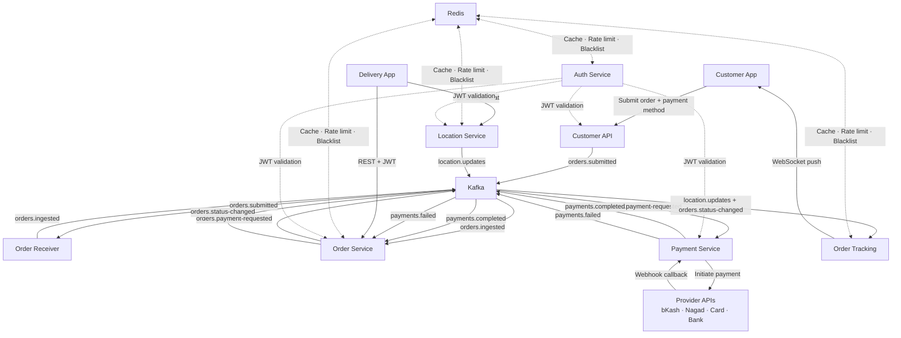

### 4.2 Technical Stack Diagram

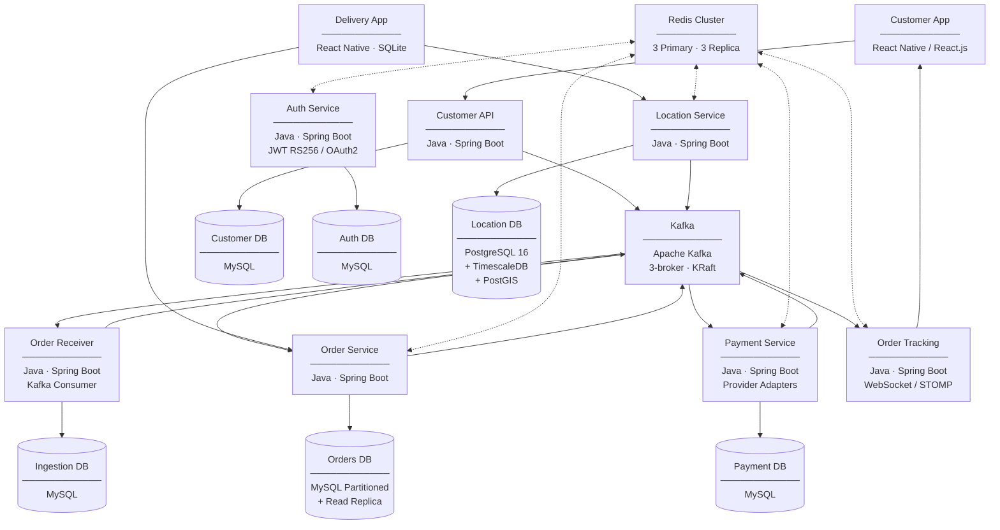

---

## 5. Database Inventory

Each service owns its database exclusively. No service reads or writes another service's database directly. All cross-service data flows through Kafka events or REST APIs.

| Service | Database | Technology | Purpose |
|---|---|---|---|
| Customer API | Customer DB | MySQL | Customer profiles, order drafts |
| Auth Service | Auth DB | MySQL | Refresh tokens, credential hashes, revocation log |
| Order Receiver | Ingestion DB | MySQL (lightweight) | Idempotency keys, received order audit log |
| Order Service | Orders DB | MySQL (partitioned) + Read Replica | Full order lifecycle and item data |
| **Payment Service** | **Payment DB** | **MySQL** | **Payment records, provider references, event log** |
| Location Service | Location DB | PostgreSQL 16 + TimescaleDB + PostGIS | Zone boundaries, delivery person location history |
| Order Tracking | *(none)* | Redis + Kafka | Stateless — tracking state in Redis |

### Cross-Service Data Flow Rule

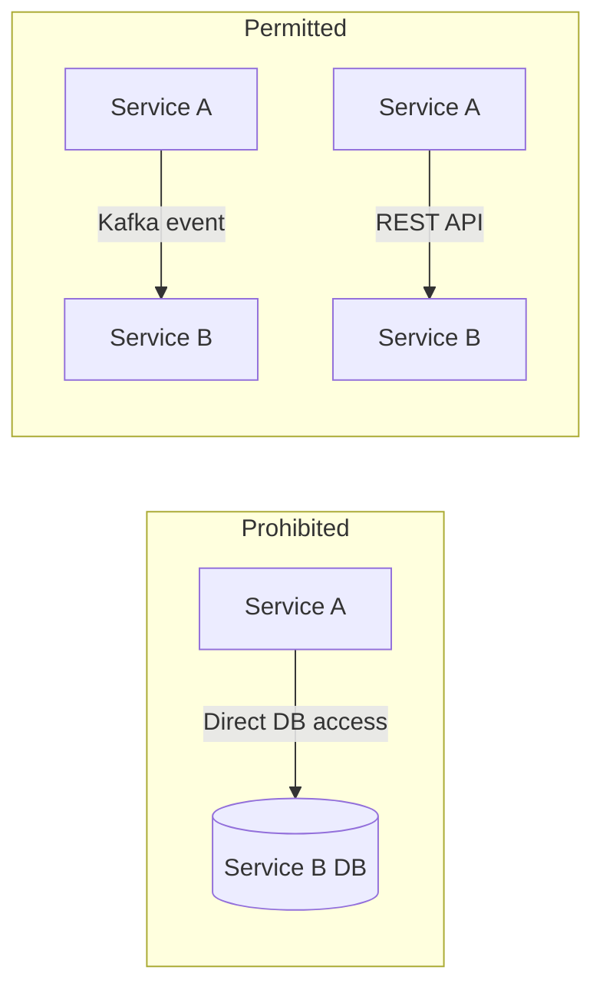

---

## 6. Zone & Delivery Model

eMudi divides Dhaka into geographic delivery zones stored as PostGIS polygons in the Location DB. Delivery persons register to one or more zones. Order assignment is zone-scoped. Only payment-confirmed orders are visible to delivery persons.

### Zone Structure (Dhaka)

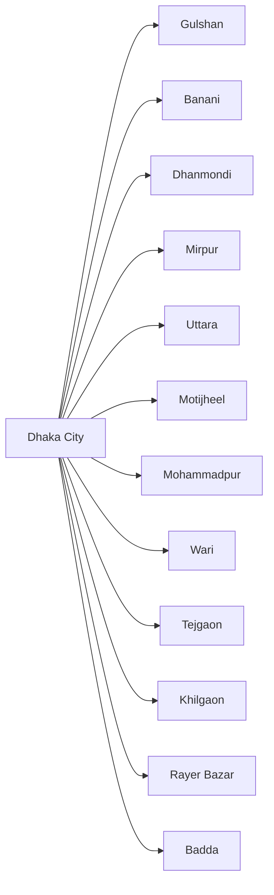

Each zone maintains a Redis set of active delivery persons and an independent PENDING order queue in the Orders DB, partitioned by `created_at` and indexed by `zone_id`.

---

## 7. Component Design

---

### 7.1 Customer App

**Type:** Mobile & Web Application  
**Technology:** React Native (iOS, Android), React.js (Web)

**Responsibilities:**
- Customer registration, login, and account management
- Create, edit, and submit grocery orders
- Select payment method and complete provider-specific payment flow (OTP entry for bKash/Nagad; redirect for Card; reference number display for Bank Transfer)
- Display `PAYMENT_PENDING` state with payment instructions; react to `payments.completed` / `payments.failed` events via WebSocket
- Real-time order tracking via WebSocket once payment confirmed and order dispatched
- Push notification receipt for all status transitions

**Redundancy:** Stateless; web served via CDN. Mobile via app stores.

---

### 7.2 Customer API Service

**Type:** Web API  
**Technology:** Java (Spring Boot)  
**Database:** Customer DB (MySQL) — exclusively owned

**Responsibilities:**
- Validate and persist customer orders with selected `paymentMethod`
- Resolve delivery address to `zoneId` via Location Service
- Publish `orders.submitted` event to Kafka on order submission
- Enforce API rate limiting via Redis

**Order Submission Payload:**

```json
{
  "deliveryAddress": "House 12, Road 5, Dhanmondi, Dhaka",
  "paymentMethod": "BKASH | NAGAD | CARD | BANK_TRANSFER",
  "paymentDetails": {
    "mobileNumber": "01XXXXXXXXX"
  },
  "items": [
    { "name": "Rice 5kg", "quantity": 1, "estimatedPrice": 350.00 }
  ]
}
```

**Redundancy:** 3 instances behind Load Balancer.

---

### 7.3 Auth Service

**Type:** Web API  
**Technology:** Java (Spring Boot), JWT RS256 / OAuth2  
**Database:** Auth DB (MySQL) — exclusively owned  
**Cache:** Redis (JWT blacklist)

**Responsibilities:**
- Issue and rotate JWT access tokens (15 min) and refresh tokens (7 days)
- Store refresh tokens and bcrypt-hashed credentials in Auth DB
- Revoked token JTIs written to Redis with TTL = remaining token lifetime
- Services validate JWT signatures locally via shared RS256 public key; revocation checked against Redis on every request

**Roles:** `CUSTOMER` · `DELIVERY_PERSON` · `ZONE_ADMIN` · `SYSTEM_ADMIN`

**Redundancy:** 2 instances behind Load Balancer.

---

### 7.4 Kafka — Message Broker

**Type:** Distributed Message Broker — In Scope  
**Technology:** Apache Kafka (3-broker cluster, RF=3, KRaft mode)

Kafka is the integration backbone. All inter-service communication that does not require an immediate response flows through Kafka. This includes the full payment event chain — from payment request through provider webhook processing to order state updates — ensuring no synchronous dependency between services.

See [Section 9 — Kafka Design](#9-kafka-design) for full topic configuration.

**Redundancy:** 3-broker cluster; RF=3; min ISR=2; automatic leader election on broker failure.

---

### 7.5 Order Receiver

**Type:** Background Service  
**Technology:** Java (Spring Boot), Kafka Consumer  
**Database:** Ingestion DB (MySQL) — exclusively owned

**Responsibilities:**
- Consume `orders.submitted` from Kafka
- Deduplicate via `orderId` idempotency key checked against Ingestion DB
- Validate message schema
- Write received record to Ingestion DB (audit trail)
- Publish `orders.ingested` to Kafka for Order Service consumption

**Architecture:**

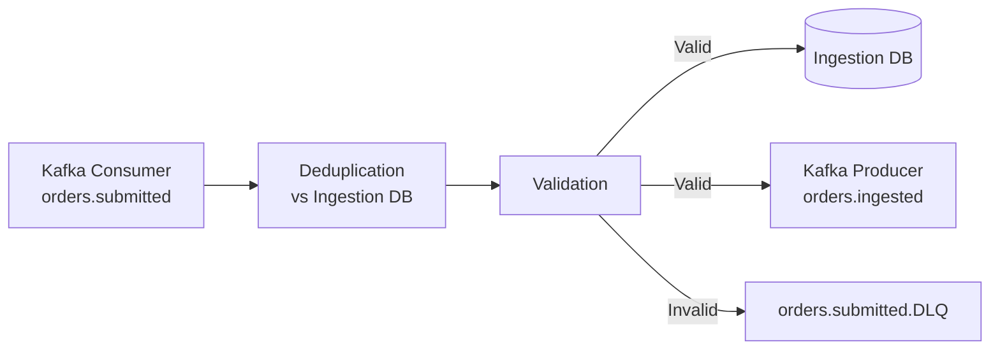

**Redundancy:** Consumer Group, 3 instances. Kafka partitions by `zoneId` — each instance handles a subset of zones.

---

### 7.6 Order Service

**Type:** Web API + Kafka Consumer  
**Technology:** Java (Spring Boot)  
**Database:** Orders DB (MySQL, monthly partitioned + Read Replica) — exclusively owned  
**Cache:** Redis (order state cache)

**Responsibilities:**
- Consume `orders.ingested` → persist order as `PAYMENT_PENDING`
- Publish `orders.payment-requested` to Kafka → triggers Payment Service
- Consume `payments.completed` → advance order to `PAYMENT_CONFIRMED` then `PENDING`
- Consume `payments.failed` → advance order to `PAYMENT_FAILED`
- Serve next available `PENDING` order for a delivery person's zone (SKIP LOCKED)
- Accept item-level updates (collected / unavailable)
- Advance order through delivery lifecycle states
- Publish `orders.status-changed` on every state transition
- Publish `orders.settled` after delivery confirmation (accounting record)

**Order Assignment — SKIP LOCKED:**

At 500–10,000 concurrent delivery persons per zone, `SELECT ... FOR UPDATE SKIP LOCKED` provides contention-free concurrent order assignment at the DB layer. Each concurrent requestor immediately claims a unique pending order without waiting or retry.

```sql
BEGIN;
  SELECT id, zone_id, customer_id, items
  FROM orders
  WHERE zone_id = :zoneId
    AND status  = 'PENDING'
  ORDER BY created_at ASC
  LIMIT 1
  FOR UPDATE SKIP LOCKED;

  UPDATE orders
  SET status = 'ASSIGNED', delivery_person_id = :dpId, assigned_at = NOW()
  WHERE id = :orderId;
COMMIT;
```

**Architecture:**

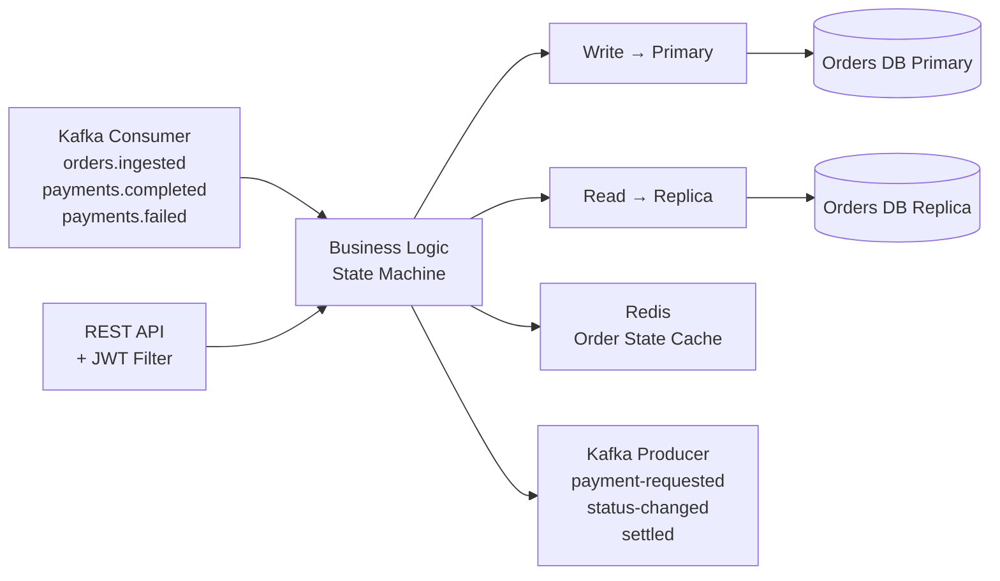

**Redundancy:** 3 instances behind Load Balancer.

---

### 7.7 Location Service

**Type:** Web API + Kafka Producer  
**Technology:** Java (Spring Boot), PgBouncer  
**Database:** Location DB (PostgreSQL 16 + TimescaleDB + PostGIS) — exclusively owned  
**Cache:** Redis (location cache, active rider sets)

**Responsibilities:**
- Accept GPS heartbeats from active delivery persons (every 15 seconds)
- Write location points to TimescaleDB hypertable
- Update Redis delivery person location cache (90s TTL — auto-expiry = offline detection)
- Maintain `zone:riders:{zoneId}` Redis set
- Resolve customer delivery address to `zoneId` via PostGIS `ST_Contains`
- Publish `location.updates` to Kafka for Order Tracking consumption
- Manage zone boundary definitions (PostGIS polygons)

**TimescaleDB Schema:**

```sql
-- Location history hypertable
CREATE TABLE location_history (
    delivery_person_id  UUID          NOT NULL,
    order_id            UUID,
    zone_id             VARCHAR(50)   NOT NULL,
    latitude            DECIMAL(10,7) NOT NULL,
    longitude           DECIMAL(10,7) NOT NULL,
    recorded_at         TIMESTAMPTZ   NOT NULL
);

SELECT create_hypertable('location_history', 'recorded_at',
    chunk_time_interval => INTERVAL '1 day');

ALTER TABLE location_history SET (
    timescaledb.compress,
    timescaledb.compress_segmentby = 'delivery_person_id',
    timescaledb.compress_orderby   = 'recorded_at DESC'
);

SELECT add_compression_policy('location_history', INTERVAL '7 days');
SELECT add_retention_policy('location_history', INTERVAL '90 days');

-- Continuous aggregate for analytics
CREATE MATERIALIZED VIEW location_hourly
WITH (timescaledb.continuous) AS
SELECT time_bucket('1 hour', recorded_at) AS bucket,
       zone_id, delivery_person_id,
       COUNT(*) AS ping_count,
       AVG(latitude) AS avg_lat, AVG(longitude) AS avg_lng
FROM location_history
GROUP BY bucket, zone_id, delivery_person_id;

-- Zone boundaries
CREATE TABLE zones (
    zone_id    VARCHAR(50) PRIMARY KEY,
    name       VARCHAR(100) NOT NULL,
    city       VARCHAR(100) NOT NULL DEFAULT 'Dhaka',
    boundary   GEOMETRY(Polygon, 4326) NOT NULL,
    active     BOOLEAN DEFAULT true,
    created_at TIMESTAMPTZ DEFAULT NOW()
);

CREATE INDEX zones_boundary_idx ON zones USING GIST(boundary);
```

**Redundancy:** 2 instances at launch → 6–8 at scale. PgBouncer (transaction mode) deployed between Location Service and PostgreSQL to prevent connection exhaustion.

---

### 7.8 Order Tracking Service

**Type:** Web API + WebSocket Server  
**Technology:** Java (Spring Boot), WebSocket / STOMP over SockJS  
**Database:** None (stateless)  
**Cache:** Redis (tracking state)

**Responsibilities:**
- Maintain WebSocket connections with customers tracking active orders
- Consume `location.updates` and `orders.status-changed` from Kafka
- Push real-time location and status updates to connected customers (< 3s latency)
- Read and write tracking state in Redis (`order:tracking:{orderId}`)

**Redundancy:** 2 → 6 instances behind sticky-session Load Balancer. Redis holds all state — reconnecting clients are served by any instance.

---

### 7.9 Delivery App

**Type:** Standalone Mobile App with Offline Support  
**Technology:** React Native (Android-first; iOS compatible)  
**Local Storage:** Encrypted SQLite (`react-native-encrypted-storage`)

**Responsibilities:**
- Login and zone activation
- Display assigned (payment-confirmed) order
- Mark items as collected or unavailable
- Confirm dispatch and delivery
- GPS heartbeat every 15 seconds
- Sync offline changes on reconnection

**Redundancy:** Not applicable — single user per device.

---

### 7.10 Redis Cache

**Type:** Distributed In-Memory Cache  
**Technology:** Redis Cluster (3 primary + 3 replica nodes)

| Function | Key Pattern | Type | TTL | Purpose |
|---|---|---|---|---|
| Order state cache | `order:status:{orderId}` | Hash | 24h | Fast status reads without DB round-trip |
| Delivery person location | `delivery:location:{dpId}` | Hash | 90s | Sub-ms location reads; auto-expiry = offline |
| Active riders per zone | `zone:riders:{zoneId}` | Set | Heartbeat-refreshed | Active delivery person lookup per zone |
| JWT blacklist | `auth:blacklist:{jti}` | String | Token remaining TTL | Token revocation without DB lookup |
| Payment state cache | `payment:status:{orderId}` | Hash | 2h | Fast payment status reads for customer polling |
| API rate limiting | `ratelimit:{userId}:{route}` | String (INCR) | 60s sliding window | Abuse protection |
| Order tracking state | `order:tracking:{orderId}` | Hash | 24h | WebSocket push state |

**High Availability:** 3-node cluster, one replica each. Automatic failover via Redis Sentinel. AOF persistence with `appendfsync everysec`.

---

### 7.11 Payment Service

**Type:** Web API + Kafka Consumer  
**Technology:** Java (Spring Boot)  
**Database:** Payment DB (MySQL) — exclusively owned  
**Cache:** Redis (payment state cache)  
**Pattern:** Strategy / Provider Adapter

**Responsibilities:**
- Consume `orders.payment-requested` from Kafka
- Enforce idempotency — one payment record per `orderId`
- Route to the correct provider adapter based on `paymentMethod`
- Initiate payment with the provider; persist as `INITIATED`
- Expose per-provider webhook endpoints for async confirmation callbacks
- Validate every webhook via HMAC signature before processing
- Advance payment state machine on confirmed or failed webhooks
- Publish `payments.completed` or `payments.failed` to Kafka
- Support payment retry (customer-initiated, for `FAILED` payments)
- Escalate `TIMED_OUT` payments to ops via alert

#### Provider Adapter Pattern

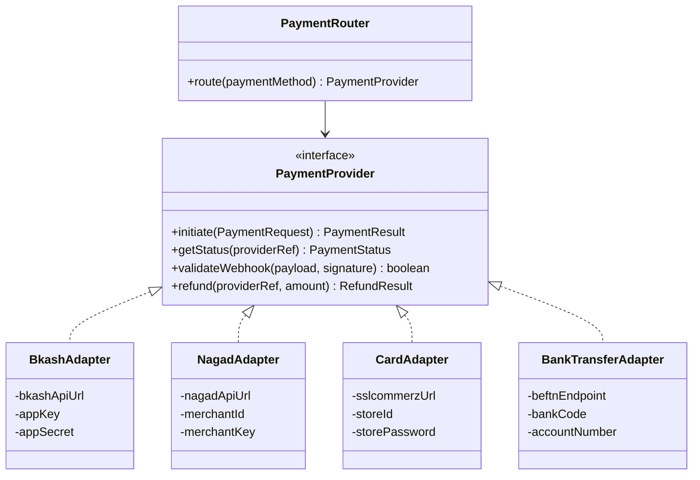

Adding a new payment provider requires only a new `PaymentProvider` implementation. No changes to the router, state machine, Kafka integration, or DB schema.

#### Provider Characteristics

| Provider | Type | Initiation | Completion | Timeout TTL |
|---|---|---|---|---|
| **bKash** | Mobile Financial Service | API call → customer OTP in bKash app | Async webhook | 10 minutes |
| **Nagad** | Mobile Financial Service | API call → customer OTP in Nagad app | Async webhook | 10 minutes |
| **Card** | Card Payment | Redirect to SSLCommerz hosted page | Async webhook | 30 minutes |
| **Bank Transfer** | Bank Network (BEFTN/NPSB) | Payment reference issued to customer | Async bank notification | 72 hours |

> Bank Transfer is T+1/T+2 by nature. Orders submitted with Bank Transfer move to `PAYMENT_PENDING` with the reference number displayed to the customer. eMudi business policy governs whether the order is dispatched before bank confirmation — default policy is to wait for confirmation.

#### Payment Lifecycle

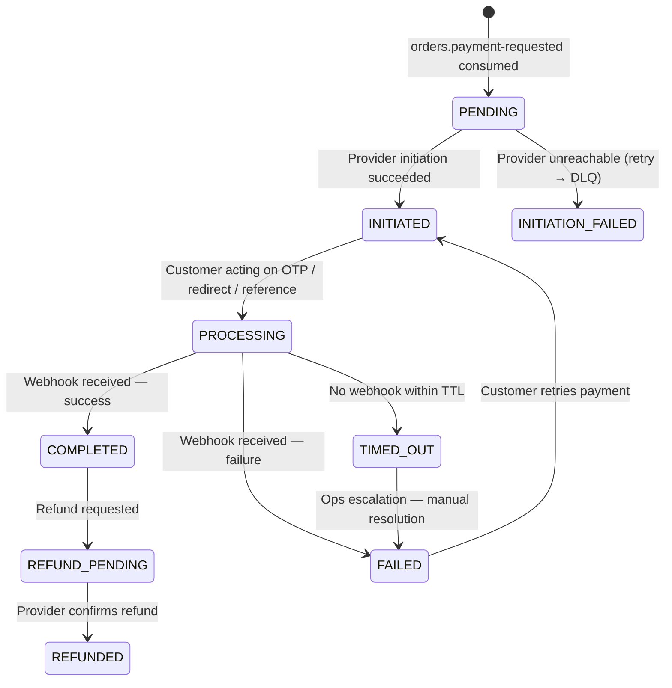

#### Webhook Validation

All provider webhook endpoints validate HMAC signature before any business logic executes:

```
1. Extract signature from provider-specific header
   (X-Bkash-Signature, X-Nagad-Signature, etc.)
2. Compute HMAC-SHA256(rawPayload, sharedSecret)
3. Compare computed vs. received — constant-time comparison to prevent timing attacks
4. Reject with 401 if mismatch — no state change, no logging of payload body
5. Proceed to idempotency check and state machine update
```

Shared secrets are stored in environment-injected secrets (not in code or DB).

#### Architecture

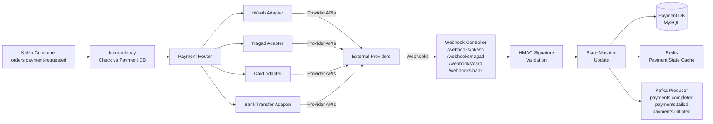

#### Payment DB Schema

```sql
CREATE TABLE payments (
    payment_id          CHAR(36)      PRIMARY KEY,
    order_id            CHAR(36)      NOT NULL UNIQUE,
    customer_id         CHAR(36)      NOT NULL,
    amount              DECIMAL(12,2) NOT NULL,
    currency            VARCHAR(3)    NOT NULL DEFAULT 'BDT',
    payment_method      ENUM('BKASH','NAGAD','CARD','BANK_TRANSFER') NOT NULL,
    status              ENUM('PENDING','INITIATED','PROCESSING','COMPLETED',
                             'FAILED','TIMED_OUT','REFUND_PENDING','REFUNDED',
                             'INITIATION_FAILED') NOT NULL DEFAULT 'PENDING',
    provider_reference  VARCHAR(255),
    bank_reference      VARCHAR(255),
    initiated_at        TIMESTAMP,
    completed_at        TIMESTAMP,
    expires_at          TIMESTAMP,
    retry_count         TINYINT       DEFAULT 0,
    created_at          TIMESTAMP     DEFAULT NOW(),
    updated_at          TIMESTAMP     DEFAULT NOW() ON UPDATE NOW()
);

CREATE TABLE payment_events (
    event_id     CHAR(36)     PRIMARY KEY,
    payment_id   CHAR(36)     NOT NULL,
    event_type   VARCHAR(100) NOT NULL,
    source       VARCHAR(50)  NOT NULL,
    payload      JSON,
    created_at   TIMESTAMP    DEFAULT NOW(),
    FOREIGN KEY (payment_id) REFERENCES payments(payment_id)
);

CREATE INDEX idx_payments_order_id  ON payments(order_id);
CREATE INDEX idx_payments_status    ON payments(status);
CREATE INDEX idx_payments_expires   ON payments(expires_at) WHERE status = 'INITIATED';
CREATE INDEX idx_events_payment_id  ON payment_events(payment_id);
```

**Redundancy:** 2 instances behind Load Balancer. Webhook endpoints are idempotent — duplicate provider callbacks do not cause duplicate state changes (idempotency checked via `payment_events` log before processing).

---

## 8. API Reference

### Customer API

| Method | Path | Description | Auth | Codes |
|---|---|---|---|---|
| `POST` | `/api/v1/auth/register` | Register customer | None | 201, 400 |
| `POST` | `/api/v1/auth/login` | Issue JWT | None | 200, 401 |
| `POST` | `/api/v1/orders` | Create grocery order | CUSTOMER | 201, 400 |
| `PUT` | `/api/v1/orders/{orderId}` | Update draft order | CUSTOMER | 200, 404 |
| `DELETE` | `/api/v1/orders/{orderId}` | Delete draft order | CUSTOMER | 204, 404 |
| `POST` | `/api/v1/orders/{orderId}/submit` | Submit order with payment method | CUSTOMER | 200, 400, 404 |

### Order Service

| Method | Path | Description | Auth | Codes |
|---|---|---|---|---|
| `GET` | `/api/v1/orders/next?zone={zoneId}` | Claim next PENDING order (SKIP LOCKED) | DELIVERY_PERSON | 200, 404 |
| `PUT` | `/api/v1/orders/{orderId}/items/{itemId}` | Mark item collected or unavailable | DELIVERY_PERSON | 200, 404 |
| `POST` | `/api/v1/orders/{orderId}/dispatch` | Mark order out for delivery | DELIVERY_PERSON | 200, 404 |
| `POST` | `/api/v1/orders/{orderId}/deliver` | Confirm delivery | DELIVERY_PERSON | 200, 404, 409 |

### Payment Service — Customer-Facing

| Method | Path | Description | Auth | Codes |
|---|---|---|---|---|
| `GET` | `/api/v1/payments/{orderId}` | Get payment status for order | CUSTOMER | 200, 404 |
| `POST` | `/api/v1/payments/{orderId}/retry` | Retry a FAILED payment | CUSTOMER | 200, 404, 409 |

> `409 Conflict` on retry if payment is not in `FAILED` status.

### Payment Service — Provider Webhooks (Public, HMAC-validated)

| Method | Path | Provider | Signature Header |
|---|---|---|---|
| `POST` | `/api/v1/payments/webhooks/bkash` | bKash | `X-Bkash-Signature` |
| `POST` | `/api/v1/payments/webhooks/nagad` | Nagad | `X-Nagad-Signature` |
| `POST` | `/api/v1/payments/webhooks/card` | SSLCommerz / Card Gateway | `X-SSLCommerz-Signature` |
| `POST` | `/api/v1/payments/webhooks/bank-transfer` | Bank (BEFTN/NPSB) | `X-Bank-Signature` |

### Location Service

| Method | Path | Description | Auth | Codes |
|---|---|---|---|---|
| `POST` | `/api/v1/location/heartbeat` | Submit GPS position | DELIVERY_PERSON | 200, 400 |
| `POST` | `/api/v1/location/resolve-zone` | Resolve address to zoneId | SYSTEM | 200, 400 |
| `GET` | `/api/v1/location/zones` | List all active zones | ZONE_ADMIN | 200 |
| `POST` | `/api/v1/location/zones` | Create zone with boundary polygon | ZONE_ADMIN | 201, 400 |
| `PUT` | `/api/v1/location/zones/{zoneId}` | Update zone boundary | ZONE_ADMIN | 200, 404 |
| `GET` | `/api/v1/location/zones/{zoneId}/riders` | Active delivery persons in zone | ZONE_ADMIN | 200 |

### Auth Service

| Method | Path | Description | Auth | Codes |
|---|---|---|---|---|
| `POST` | `/api/v1/auth/login` | Issue JWT + refresh token | None | 200, 401 |
| `POST` | `/api/v1/auth/refresh` | Rotate refresh token | RefreshToken | 200, 401 |
| `POST` | `/api/v1/auth/logout` | Revoke token; blacklist JWT | JWT | 204 |

### Order Tracking Service

| Protocol | Path | Description | Auth |
|---|---|---|---|
| WebSocket | `/ws/tracking/orders/{orderId}` | Live tracking events | CUSTOMER |

### API Versioning Policy

All APIs versioned under `/api/v1/`. Breaking changes → `/api/v2/`. Prior version supported minimum 6 months. Deprecation header: `Deprecation: true; sunset="YYYY-MM-DD"`.

---

## 9. Kafka Design

### Topic Architecture

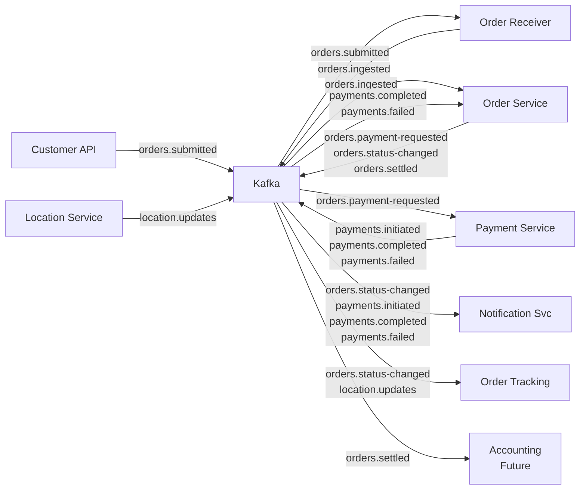

### Topic Configuration

| Topic | Producer | Consumers | Partition Key | Launch | Scale | Retention |
|---|---|---|---|---|---|---|
| `orders.submitted` | Customer API | Order Receiver | `zoneId` | 12 | 12 | 7 days |
| `orders.ingested` | Order Receiver | Order Service | `zoneId` | 12 | 12 | 3 days |
| `orders.payment-requested` | Order Service | Payment Service | `orderId` | 12 | 24 | 3 days |
| `orders.status-changed` | Order Service | Order Tracking, Notifications | `orderId` | 24 | 48 | 3 days |
| `orders.settled` | Order Service | Accounting (future) | `orderId` | 12 | 24 | 30 days |
| `payments.initiated` | Payment Service | Notifications | `orderId` | 12 | 12 | 3 days |
| `payments.completed` | Payment Service | Order Service, Notifications | `orderId` | 12 | 24 | 14 days |
| `payments.failed` | Payment Service | Order Service, Notifications | `orderId` | 12 | 24 | 7 days |
| `location.updates` | Location Service | Order Tracking | `deliveryPersonId` | 24 | 48 | 1 day |

### Consumer Groups

| Group ID | Topic(s) | Service |
|---|---|---|
| `order-receiver-group` | `orders.submitted` | Order Receiver |
| `order-service-group` | `orders.ingested`, `payments.completed`, `payments.failed` | Order Service |
| `payment-service-group` | `orders.payment-requested` | Payment Service |
| `order-tracking-group` | `orders.status-changed`, `location.updates` | Order Tracking |
| `notification-group` | `orders.status-changed`, `payments.initiated`, `payments.completed`, `payments.failed` | Notification Service |

### Error Handling

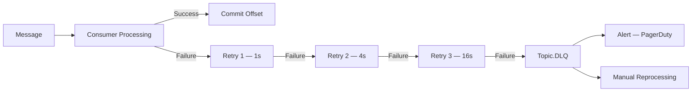

---

## 10. Redis Caching Strategy

### Order State Cache

```
Key:    order:status:{orderId}
Type:   Hash
TTL:    24h (refreshed on each state transition)
Fields: status, deliveryPersonId, zoneId, paymentMethod, updatedAt
```

### Payment State Cache

```
Key:    payment:status:{orderId}
Type:   Hash
TTL:    2h (refreshed on each payment state transition)
Fields: status, providerReference, paymentMethod, updatedAt
Use:    Fast reads for customer payment status polling — avoids DB round-trip
```

### Delivery Person Location

```
Key:    delivery:location:{deliveryPersonId}
Type:   Hash
TTL:    90s (auto-expiry = offline detection)
Fields: lat, lng, updatedAt, orderId, zoneId
```

### Active Riders Per Zone

```
Key:    zone:riders:{zoneId}
Type:   Set
TTL:    Refreshed on heartbeat; member removed on TTL expiry or logout
```

### JWT Blacklist

```
Key:    auth:blacklist:{jti}
Type:   String ("revoked")
TTL:    Remaining token lifetime
```

### Order Tracking State

```
Key:    order:tracking:{orderId}
Type:   Hash
TTL:    24h
Fields: status, deliveryPersonId, lat, lng, lastUpdated
```

### API Rate Limiting

```
Key:    ratelimit:{userId}:{route}
Type:   String (INCR + EXPIRE)
TTL:    60s sliding window / 100 requests per window
```

---

## 11. Data Design

### Unified Order & Payment Lifecycle

```mermaid
stateDiagram-v2
    [*] --> DRAFT : Customer creates order

    DRAFT --> SUBMITTED : Customer submits with paymentMethod

    SUBMITTED --> PAYMENT_PENDING : Order ingested;\npayment-requested published

    PAYMENT_PENDING --> PAYMENT_CONFIRMED : payments.completed received
    PAYMENT_PENDING --> PAYMENT_FAILED : payments.failed received
    PAYMENT_FAILED --> PAYMENT_PENDING : Customer retries payment

    PAYMENT_CONFIRMED --> PENDING : Visible to delivery persons

    PENDING --> ASSIGNED : Delivery person claims (SKIP LOCKED)
    ASSIGNED --> COLLECTING : First item marked
    COLLECTING --> COLLECTED : All items processed
    COLLECTED --> OUT_FOR_DELIVERY : Delivery person dispatches
    OUT_FOR_DELIVERY --> DELIVERED : Delivery confirmed
    DELIVERED --> SETTLED : orders.settled published (accounting)
    SETTLED --> [*]
```

> Delivery persons see only orders in `PENDING` status. Orders in any payment state are invisible to the delivery queue.

### Orders DB — Partitioning

| Parameter | Value |
|---|---|
| Partition key | `created_at` (monthly) |
| Active partitions | 12 months rolling |
| Archive | Cold storage after 12 months |
| Query alignment | `GET /orders/next?zone=` scoped to current-month partition |

### Location DB — Data Lifecycle

| Stage | Duration | Resolution | Storage |
|---|---|---|---|
| Hot (raw) | 0–7 days | 15-second intervals | Uncompressed TimescaleDB chunks |
| Warm (compressed) | 7–90 days | 15-second intervals (compressed) | ~90% storage reduction |
| Aggregated | Indefinite | 1-hour bucket (Continuous Aggregate) | Retained after raw purge |
| Purged | > 90 days | Raw rows dropped | Aggregates persist |

### Payment Data — Kafka Message (`payments.completed`)

```json
{
  "schemaVersion": "1.0",
  "paymentId": "uuid",
  "orderId": "uuid",
  "customerId": "uuid",
  "paymentMethod": "BKASH",
  "amount": 650.00,
  "currency": "BDT",
  "status": "COMPLETED",
  "providerReference": "TXN-BKASH-XXXXXXXX",
  "completedAt": "ISO 8601"
}
```

### Order Settlement — Kafka Message (`orders.settled`)

```json
{
  "schemaVersion": "1.0",
  "orderId": "uuid",
  "settledAt": "ISO 8601",
  "zoneId": "DHANMONDI",
  "deliveryPersonId": "uuid",
  "customer": {
    "customerId": "uuid",
    "deliveryAddress": "string"
  },
  "paymentMethod": "BKASH",
  "paymentReference": "TXN-BKASH-XXXXXXXX",
  "items": [
    {
      "itemId": "uuid",
      "name": "string",
      "quantity": 2,
      "unitPrice": 150.00,
      "status": "COLLECTED | UNAVAILABLE",
      "currency": "BDT"
    }
  ],
  "totalCollectedAmount": 300.00,
  "currency": "BDT"
}
```

---

## 12. Security

| Control | Implementation |
|---|---|
| Transport | TLS 1.2+ on all communication — internal and external |
| Authentication | JWT RS256; 15-min access tokens, 7-day rotating refresh tokens |
| Authorisation | RBAC per endpoint: `CUSTOMER` · `DELIVERY_PERSON` · `ZONE_ADMIN` · `SYSTEM_ADMIN` |
| Token revocation | Redis JWT blacklist; checked on every authenticated request |
| Auth DB | Refresh tokens stored hashed; credentials use bcrypt (cost factor 12) |
| Data at rest | MySQL AES-256; PostgreSQL OS-level encryption; Redis AOF encrypted |
| PII handling | Customer name and address encrypted in DB; masked in all logs |
| Kafka | SASL/SCRAM-SHA-512; TLS in transit; topic-level ACLs per service |
| Webhook security | HMAC-SHA256 signature validation on all provider webhooks; constant-time comparison; 401 on mismatch before any processing |
| Provider secrets | Stored in environment-injected secrets vault; never in code or DB |
| Delivery App | Encrypted SQLite; cached JWT in encrypted local storage |
| Device loss/theft | JWT revocation via Auth Service; local data requires device PIN |
| API rate limiting | Redis sliding window; 100 req/60s per user per route; 429 on breach |
| Webhook endpoints | IP allowlist per provider where provider publishes static IPs (bKash, Nagad support this) |
| Geocoding | Customer addresses sent to Maps Provider over TLS only |

---

## 13. Offline Strategy

### Local Storage

When a delivery person claims an order, the full order payload is persisted to encrypted local SQLite. Item updates are written locally first, then queued for sync.

### Sync Mechanism

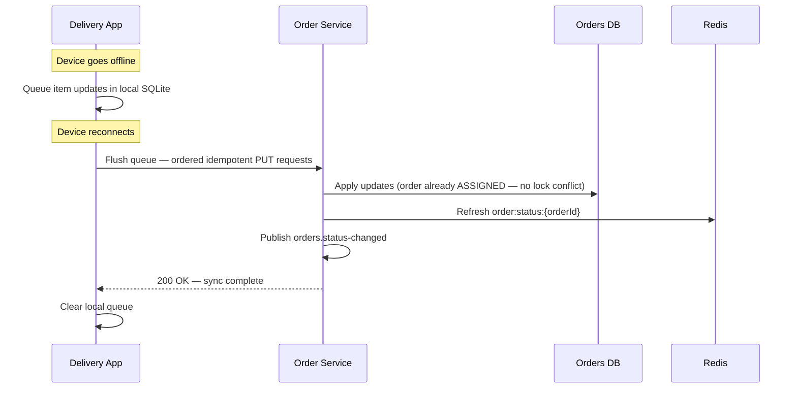

### Conflict Resolution

| Scenario | Resolution |
|---|---|
| Item marked offline; no server-side change | Local change applied on sync |
| Item marked offline; admin override applied while offline | Server wins; delivery person notified |
| Delivery confirmed offline | Queued; executed as first action on reconnect |
| Order reassigned while delivery person offline | Sync rejected; delivery person notified; local state cleared |

### Offline Capability Matrix

| Capability | Offline |
|---|---|
| View assigned order | ✅ Yes |
| Mark items collected / unavailable | ✅ Yes |
| Confirm delivery (queued) | ✅ Queued — executed on reconnect |
| GPS heartbeat | ❌ Paused — resumes on reconnect |
| Claim new order | ❌ Requires server |
| Authenticate (existing session) | ✅ Cached JWT |
| Start new session | ❌ Requires Auth Service |

---

## 14. Scaling Strategy

### Workload at Each Tier

| Metric | 500 Persons | 2,000 Persons | 10,000 Persons |
|---|---|---|---|
| Location writes/sec | ~33 | ~133 | ~667 |
| Daily location records | ~120K | ~480K | ~2.4M |
| Concurrent order requests/zone | ~42 | ~167 | ~833 |
| Active WebSocket connections | ~500 | ~2,000 | ~10,000 |
| Payment webhook rate (peak) | ~12/min | ~48/min | ~240/min |

### Phase 1 — Launch (500)

| Component | Configuration |
|---|---|
| Location Service | 2 instances |
| Order Service | 3 instances |
| Payment Service | 2 instances |
| Order Tracking | 2 instances |
| Kafka `location.updates` | 24 partitions |
| TimescaleDB | Single node + PgBouncer |
| Redis | 3-node cluster |

### Phase 2 — Growth (2,000)

| Component | Change |
|---|---|
| Location Service | 4 instances |
| Order Tracking | 4 instances |
| Payment Service | 3 instances |
| Kafka `location.updates` | 36 partitions |
| TimescaleDB | Enable read replica for analytics |

### Phase 3 — Scale (10,000)

| Component | Change |
|---|---|
| Location Service | 6–8 instances |
| Order Service | 6 instances |
| Order Tracking | 6 instances |
| Payment Service | 4 instances |
| Kafka `location.updates` | 48 partitions |
| Kafka `orders.status-changed` | 48 partitions |
| TimescaleDB | Timescale Cloud managed or distributed hypertable |
| Orders DB | Evaluate zone-based sharding |
| Redis | Increase memory per shard |

### Order Assignment at Scale

With 833 concurrent delivery persons per zone, `SKIP LOCKED` provides contention-free parallel assignment. All 833 requestors complete in one round of concurrent transactions — zero blocking, zero retry loops, zero Redis coordination.

### Zone Sub-partitioning

If a zone exceeds ~1,000 delivery persons, it can be administratively subdivided (e.g. DHANMONDI → DHANMONDI_NORTH / SOUTH). The zone model, Kafka partition key, PostGIS boundary system, and SKIP LOCKED query all support this natively. It is an operational change, not an architectural one.

---

## 15. Observability

### Health Checks

All services expose `GET /actuator/health` with component-level detail for load balancer and orchestrator routing.

### Logging

- Centralised via ELK Stack
- Structured JSON logs; `X-Correlation-ID` propagated across HTTP headers and Kafka message headers
- PII fields excluded at log-appender level
- Payment provider payloads logged with sensitive fields masked

### Key Metrics & Alerts

| Metric | Source | Alert |
|---|---|---|
| Kafka consumer lag — all groups | Kafka | > 500 messages |
| DLQ depth — any topic | Kafka | > 0 |
| Payment initiation latency p99 | Payment Service APM | > 2s |
| Webhook processing latency p99 | Payment Service APM | > 500ms |
| Payments in TIMED_OUT status | Payment DB | > 0 (immediate alert) |
| Payment success rate per method | Payment Service | < 95% per provider per hour |
| HMAC validation failures per provider | Payment Service | > 5/min per provider |
| Order assignment latency p99 | Order Service APM | > 500ms |
| Tracking WebSocket push latency | OTS APM | > 3s |
| TimescaleDB compression lag | TimescaleDB | > 24h behind policy |
| Redis memory utilisation | Redis Cluster | > 75% |
| Location heartbeat gap | Location Service | > 120s per active rider |
| Orders DB Read Replica lag | MySQL | > 30s |
| Auth failed attempts | Auth Service | > 20/min |

### Dashboards

| Dashboard | Audience | Key Content |
|---|---|---|
| **Operational** | On-call engineers | Kafka lag, DLQ depth, service health, error rates, TIMED_OUT payments |
| **Payment Operations** | Finance / Ops | Payment success rate per provider, TIMED_OUT queue, retry rate, refund status |
| **Delivery Operations** | Ops management | Active riders per zone, orders/hour, collection rate, zone utilisation |
| **Customer Experience** | Product team | Order fulfillment time, tracking latency, payment success UX, unavailable item rate |
| **Capacity** | Infrastructure | DB partition growth, Kafka throughput, TimescaleDB chunk size, Redis memory |

---

## 16. Deployment Architecture

### Physical / HA Diagram

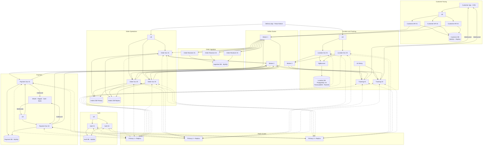

### Redundancy Summary

| Component | Redundancy | Instances (Launch → Scale) |
|---|---|---|
| Customer App | CDN multi-origin | Stateless |
| Customer API | Load Balancer | 3 |
| Auth Service | Load Balancer | 2 |
| Kafka | 3-broker cluster RF=3 KRaft | 3 brokers |
| Order Receiver | Kafka Consumer Group | 3 |
| Ingestion DB | Primary only | 1 |
| Order Service | Load Balancer | 3 → 6 |
| Orders DB | Primary + Read Replica | 2 |
| Payment Service | Load Balancer | 2 → 4 |
| Payment DB | Primary + Read Replica | 2 |
| Location Service | Load Balancer | 2 → 8 |
| Location DB | PgBouncer + PostgreSQL | 1 → 2 nodes |
| Order Tracking | Load Balancer (sticky) | 2 → 6 |
| Redis | Cluster 3P + 3R | 6 nodes |
| Delivery App | N/A — single user per device | — |

---

## 17. Extensibility

### Payment Providers

Adding a new payment provider (e.g. Rocket, COD) requires:
1. Implement `PaymentProvider` interface (adapter class only)
2. Register with `PaymentRouter`
3. Add HMAC secret to secrets vault
4. Add webhook endpoint to Payment Service controller
5. No changes to Kafka, Order Service, DB schema, or any other service

### Delivery Categories

The platform supports additional delivery categories (pharmacy, restaurant) via:
- `orderType` enum field on orders (`GROCERY`, `PHARMACY`, `RESTAURANT`)
- Strategy pattern on `orderType` in Order Service for category-specific rules
- `orderType`-specific screen templates in Delivery App
- Zone model, Kafka, Redis, Auth, Location, and Tracking services require no change

### Adding a Delivery Category

1. Add `orderType` enum value
2. Implement type-specific strategy in Order Service
3. Add screen template to Delivery App
4. Update `orders.settled` schema `schemaVersion` if payload changes
5. No infrastructure changes required

---

## 18. Architecture Decision Records

### ADR-01 — Kafka as Owned Infrastructure

**Decision:** Apache Kafka deployed and operated by eMudi.  
**Rationale:** Kafka is the integration backbone for 7 services and the full payment event chain. Owning it gives complete control over topic design, partition strategy, retention, DLQ policy, and observability. Managed alternatives lack partition-ordered delivery and consumer group semantics required for zone-ordered ingestion.  
**Alternatives:** AWS SQS, RabbitMQ — simpler to operate but insufficient for ordered, partitioned, replayable messaging at this topology.

---

### ADR-02 — Database Per Service

**Decision:** Each service owns its database exclusively. No cross-service DB access.  
**Rationale:** Shared databases create hidden coupling — schema changes cascade across service boundaries and prevent independent deployment and scaling. All inter-service data flows through Kafka events or REST.  
**Tradeoff:** Eventual consistency between service data stores. Briefly, order status in Orders DB and payment status in Payment DB may diverge by seconds. Acceptable — each store serves a distinct bounded context.  
**Alternatives:** Shared Orders DB — operationally simpler; architecturally coupled; rejected.

---

### ADR-03 — PostgreSQL + TimescaleDB + PostGIS for Location Service

**Decision:** Location DB uses PostgreSQL 16 with TimescaleDB and PostGIS extensions.  
**Rationale:** The workload is time-series writes (667/sec at scale) with geospatial query requirements (zone polygon intersection, path analytics). TimescaleDB provides automatic chunking, 90% columnar compression, continuous aggregates, and retention policies. PostGIS provides `ST_Contains` for zone resolution. Both coexist on one PostgreSQL instance — one engine for two distinct needs. MySQL's geospatial support is insufficient; Cassandra has no geospatial support and no aggregation capability.  
**Alternatives:** MySQL (limited geospatial, no time-series compression), Cassandra (no geospatial, no GROUP BY, unjustifiable operational cost at this scale), InfluxDB (no geospatial) — all rejected.

---

### ADR-04 — SKIP LOCKED for Order Assignment

**Decision:** Use `SELECT ... FOR UPDATE SKIP LOCKED` for concurrent order assignment.  
**Rationale:** At 833 concurrent delivery persons per zone, a Redis distributed lock serialises all assignment requests into a queue. SKIP LOCKED allows each concurrent transaction to immediately claim a unique pending order — O(n) parallel throughput for n concurrent claimants. Supported natively in MySQL 8+ and PostgreSQL. No Redis lock needed for this operation.  
**Alternatives:** Redis distributed lock (v1.0) — adequate at 200 concurrent users; bottleneck at 833/zone; removed. Optimistic locking — requires collision retry; inferior access pattern.

---

### ADR-05 — Order Receiver Decoupled via orders.ingested

**Decision:** Order Receiver publishes `orders.ingested` after validation; Order Service subscribes.  
**Rationale:** Required by ADR-02. Eliminates all inter-service DB coupling. The Order Service is fully source-agnostic — it only knows about `orders.ingested`. Transport changes affect only the Order Receiver.  
**Alternatives:** Shared Orders DB write — violates ADR-02; rejected.

---

### ADR-06 — PgBouncer for TimescaleDB Connection Pooling

**Decision:** PgBouncer in transaction mode between Location Service instances and PostgreSQL.  
**Rationale:** PostgreSQL has a hard connection limit. At 8 Location Service instances with internal connection pools, raw connections exhaust PostgreSQL. PgBouncer multiplexes application connections into a small pool of actual DB connections, enabling horizontal Location Service scaling without PostgreSQL connection exhaustion.

---

### ADR-07 — React Native for Delivery App

**Decision:** React Native over native Android or WPF.  
**Rationale:** Offline mode support, Android-first with iOS compatibility, no device setup, one codebase, cost-effective Android hardware widely available in Dhaka. Deep OS access is not required.

---

### ADR-08 — JWT with Offline Token Caching

**Decision:** Short-lived JWTs (15 min) with rotating refresh tokens (7 days), cached in encrypted local storage on the Delivery App.  
**Rationale:** Delivery persons operate offline for extended periods. Cached token provides session continuity. Redis blacklist enables immediate revocation.

---

### ADR-09 — WebSocket with Sticky Sessions for Tracking

**Decision:** Order Tracking Service uses WebSocket (STOMP/SockJS) with sticky session load balancing.  
**Rationale:** WebSocket connections are stateful. Sticky sessions maintain connection routing. Redis stores all tracking state so any instance serves reconnecting clients.

---

### ADR-10 — Kafka Partitioned by zoneId for Order Ingestion

**Decision:** `orders.submitted` and `orders.ingested` partitioned by `zoneId`.  
**Rationale:** Guarantees ordered delivery per zone to the same consumer instance, eliminating cross-instance ordering conflicts without distributed coordination.

---

### ADR-11 — Payment Provider Adapter Pattern

**Decision:** Payment Service uses a Strategy/Adapter pattern — one adapter per provider behind a common `PaymentProvider` interface.  
**Rationale:** Each provider has a different API, auth mechanism, webhook format, and timeout policy. The adapter pattern isolates all provider complexity from the core payment state machine. Adding a provider requires a new adapter class only — no changes to router, state machine, Kafka integration, or DB schema.  
**Alternatives:** Payment aggregator (SSLCommerz supports bKash, Nagad, and card) — simpler for Phase 1 but introduces a single point of failure and limits control over provider-specific flows and webhook validation.

---

### ADR-12 — Async-First Payment Architecture with Pre-Pay Model

**Decision:** All payment provider interactions are asynchronous. Payment is confirmed before an order is made available to delivery persons.  
**Rationale:** All four provisioned providers complete via webhook, not synchronous response. Designing for synchronous completion would require fragile polling. Pre-pay ensures delivery persons never handle unpaid orders, eliminating collection-without-payment risk. Bank Transfer's T+1/T+2 settlement is handled by business policy (hold or dispatch) — the architecture supports both.  
**Tradeoff:** Customer UX requires a `PAYMENT_PENDING` state with a real-time update on confirmation. Handled via WebSocket push from Order Tracking Service on `orders.status-changed` event.

---

### ADR-13 — HMAC Webhook Validation

**Decision:** All provider webhooks validated via HMAC-SHA256 signature before any processing.  
**Rationale:** Webhook endpoints are publicly accessible. Without signature validation, any actor could POST a fabricated `COMPLETED` event and trigger order fulfilment without actual payment — a direct financial fraud vector. HMAC validation with constant-time comparison prevents timing attacks. Requests with invalid or missing signatures return 401 before any state change or payload logging.  
**Implementation:** Shared secrets stored in secrets vault (not in code or DB); rotated per provider contract.

---

*Document prepared by the eMudi Systems Architecture team.*  
*For amendments, raise an Architecture Review Board (ARB) change request.*  
*Supersedes: emudi-architecture-v1.1*
